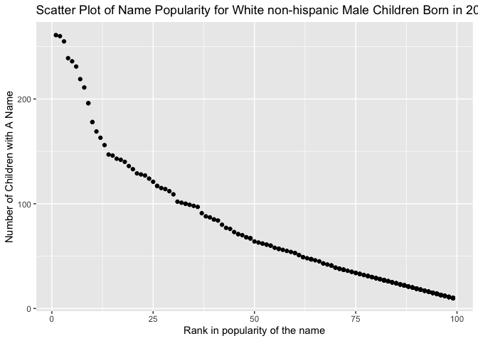

p8105\_hw2\_ym2813
================
Anna Ma
10/4/2021

``` r
library(tidyverse)
library(readxl)
```

## Problem 1

Read and clean the Mr.Trash Wheel sheet

``` r
trash_wheel_df = 
  read_excel("data_hw2/Trash-Wheel-Collection-Totals-7-2020-2.xlsx", 
             sheet = 1, col_names = TRUE, range = "A2:N534") %>% 
  janitor::clean_names() %>%  #clean the variable names
  drop_na(dumpster) %>% #omitting rows without dumpster-specific data
  rename(weight = weight_tons,volume = volume_cubic_yards) %>% #reasonable variable name 
  mutate(sports_balls = round(sports_balls,0)) #round sports_ball to integer

trash_wheel_df
```

    ## # A tibble: 453 × 14
    ##    dumpster month  year date                weight volume plastic_bottles
    ##       <dbl> <chr> <dbl> <dttm>               <dbl>  <dbl>           <dbl>
    ##  1        1 May    2014 2014-05-16 00:00:00   4.31     18            1450
    ##  2        2 May    2014 2014-05-16 00:00:00   2.74     13            1120
    ##  3        3 May    2014 2014-05-16 00:00:00   3.45     15            2450
    ##  4        4 May    2014 2014-05-17 00:00:00   3.1      15            2380
    ##  5        5 May    2014 2014-05-17 00:00:00   4.06     18             980
    ##  6        6 May    2014 2014-05-20 00:00:00   2.71     13            1430
    ##  7        7 May    2014 2014-05-21 00:00:00   1.91      8             910
    ##  8        8 May    2014 2014-05-28 00:00:00   3.7      16            3580
    ##  9        9 June   2014 2014-06-05 00:00:00   2.52     14            2400
    ## 10       10 June   2014 2014-06-11 00:00:00   3.76     18            1340
    ## # … with 443 more rows, and 7 more variables: polystyrene <dbl>,
    ## #   cigarette_butts <dbl>, glass_bottles <dbl>, grocery_bags <dbl>,
    ## #   chip_bags <dbl>, sports_balls <dbl>, homes_powered <dbl>

Read and clean precipitation data for 2018

``` r
precipitation_2018_df = 
  read_excel("data_hw2/Trash-Wheel-Collection-Totals-7-2020-2.xlsx", 
             sheet = 7, range = "A2:B15") %>% 
  janitor::clean_names() %>% 
  drop_na() %>% 
  mutate(year = "2018") %>% 
  select(year,month,total)

precipitation_2018_df
```

    ## # A tibble: 12 × 3
    ##    year  month total
    ##    <chr> <dbl> <dbl>
    ##  1 2018      1  0.94
    ##  2 2018      2  4.8 
    ##  3 2018      3  2.69
    ##  4 2018      4  4.69
    ##  5 2018      5  9.27
    ##  6 2018      6  4.77
    ##  7 2018      7 10.2 
    ##  8 2018      8  6.45
    ##  9 2018      9 10.5 
    ## 10 2018     10  2.12
    ## 11 2018     11  7.82
    ## 12 2018     12  6.11

Read and clean precipitation data for 2019

``` r
precipitation_2019_df = 
  read_excel("data_hw2/Trash-Wheel-Collection-Totals-7-2020-2.xlsx", 
             sheet = 6, range = "A2:B15") %>% 
  janitor::clean_names() %>% 
  drop_na() %>% 
  mutate(year = "2019") %>% 
  select(year,month,total)

precipitation_2019_df
```

    ## # A tibble: 12 × 3
    ##    year  month total
    ##    <chr> <dbl> <dbl>
    ##  1 2019      1  3.1 
    ##  2 2019      2  3.64
    ##  3 2019      3  4.47
    ##  4 2019      4  1.46
    ##  5 2019      5  3.58
    ##  6 2019      6  0.42
    ##  7 2019      7  3.85
    ##  8 2019      8  2.39
    ##  9 2019      9  0.16
    ## 10 2019     10  5.45
    ## 11 2019     11  1.86
    ## 12 2019     12  3.57

Combine precipitation datasets and convert month to a character variable

``` r
precipitation_both_df = 
  bind_rows(precipitation_2018_df, precipitation_2019_df) %>% 
  mutate(month = month.name[month])

precipitation_both_df
```

    ## # A tibble: 24 × 3
    ##    year  month     total
    ##    <chr> <chr>     <dbl>
    ##  1 2018  January    0.94
    ##  2 2018  February   4.8 
    ##  3 2018  March      2.69
    ##  4 2018  April      4.69
    ##  5 2018  May        9.27
    ##  6 2018  June       4.77
    ##  7 2018  July      10.2 
    ##  8 2018  August     6.45
    ##  9 2018  September 10.5 
    ## 10 2018  October    2.12
    ## # … with 14 more rows

In the Mr. Trash Wheel data set, we have a total of 453 observations,
each representing a dumpster. The data has 14 variables, collecting key
information about Mr. Trash Wheel such as specific dumpster number,
date, amount of trash they collected in weight and volume, types of
trash they collected such as bottles, polystyrene, cigarette butts, and
bags, and the homes they powered. The median number of sports balls in a
dumpster in 2019 is 9.

In the data set for precipitation in 2018, we have a total of
12observations, and 3 variables, which lists out month and precipitation
within that month.

Similarly, in the 2019 precipitation data set, we have a total of 12
observations and 3 variables that lists the month and precipitation.

In the combined data set, we have 24 observations, and 3 variables
listing out the month with precipitations in both 2018 and 2019; and
also the total amount of precipitation in each month and year. The total
precipitation in 2018 is 70.33

## Problem 2

Read and clean the data in pols\_month

``` r
pols_month_df = 
  read_csv("data_hw2/fivethirtyeight_datasets/pols-month.csv") %>% 
  separate("mon",c("year","month","day"),sep = "-") %>% 
  mutate(
    month = month.name[as.numeric(month)],
    president = case_when(prez_gop >= 1 ~ "gop",
                          prez_dem == 1 ~ "dem")
    ) %>% 
  select(-c(day,prez_dem,prez_gop))

pols_month_df
```

    ## # A tibble: 822 × 9
    ##    year  month     gov_gop sen_gop rep_gop gov_dem sen_dem rep_dem president
    ##    <chr> <chr>       <dbl>   <dbl>   <dbl>   <dbl>   <dbl>   <dbl> <chr>    
    ##  1 1947  January        23      51     253      23      45     198 dem      
    ##  2 1947  February       23      51     253      23      45     198 dem      
    ##  3 1947  March          23      51     253      23      45     198 dem      
    ##  4 1947  April          23      51     253      23      45     198 dem      
    ##  5 1947  May            23      51     253      23      45     198 dem      
    ##  6 1947  June           23      51     253      23      45     198 dem      
    ##  7 1947  July           23      51     253      23      45     198 dem      
    ##  8 1947  August         23      51     253      23      45     198 dem      
    ##  9 1947  September      23      51     253      23      45     198 dem      
    ## 10 1947  October        23      51     253      23      45     198 dem      
    ## # … with 812 more rows

read and clean the data in snp.csv

``` r
snp_df = 
  read_csv("data_hw2/fivethirtyeight_datasets/snp.csv") %>%
  separate(date,c("month","day","year"),sep = "/") %>% 
  mutate(year = as.numeric(year),
         month = as.numeric(month),
         year = case_when(year <= 15 ~ 2000+ year ,
                          year > 15 ~ 1900+year)) %>% 
  arrange(year,month) %>% 
  mutate(
     month = month.name[month],
     year = as.character(year)) %>% 
  select(year,month,everything()) 

snp_df
```

    ## # A tibble: 787 × 4
    ##    year  month     day   close
    ##    <chr> <chr>     <chr> <dbl>
    ##  1 1950  January   3      17.0
    ##  2 1950  February  1      17.2
    ##  3 1950  March     1      17.3
    ##  4 1950  April     3      18.0
    ##  5 1950  May       1      18.8
    ##  6 1950  June      1      17.7
    ##  7 1950  July      3      17.8
    ##  8 1950  August    1      18.4
    ##  9 1950  September 1      19.5
    ## 10 1950  October   2      19.5
    ## # … with 777 more rows

Tidy the unemployment data set

``` r
unemployment_df = 
  read_csv("data_hw2/fivethirtyeight_datasets/unemployment.csv",
           col_names = c("year", "1":"12"),skip = 1) %>%
  pivot_longer(
    "1":"12",
    names_to = "month",
    values_to = "percentage") %>% 
  mutate(
     month = month.name[as.numeric(month)],
     year = as.character(year))

unemployment_df
```

    ## # A tibble: 816 × 3
    ##    year  month     percentage
    ##    <chr> <chr>          <dbl>
    ##  1 1948  January          3.4
    ##  2 1948  February         3.8
    ##  3 1948  March            4  
    ##  4 1948  April            3.9
    ##  5 1948  May              3.5
    ##  6 1948  June             3.6
    ##  7 1948  July             3.6
    ##  8 1948  August           3.9
    ##  9 1948  September        3.8
    ## 10 1948  October          3.7
    ## # … with 806 more rows

Join the data sets

``` r
combined_df = 
  left_join(pols_month_df, snp_df, by = c("year","month")) %>% 
  left_join(unemployment_df, by = c("year","month"))

combined_df
```

    ## # A tibble: 822 × 12
    ##    year  month   gov_gop sen_gop rep_gop gov_dem sen_dem rep_dem president day  
    ##    <chr> <chr>     <dbl>   <dbl>   <dbl>   <dbl>   <dbl>   <dbl> <chr>     <chr>
    ##  1 1947  January      23      51     253      23      45     198 dem       <NA> 
    ##  2 1947  Februa…      23      51     253      23      45     198 dem       <NA> 
    ##  3 1947  March        23      51     253      23      45     198 dem       <NA> 
    ##  4 1947  April        23      51     253      23      45     198 dem       <NA> 
    ##  5 1947  May          23      51     253      23      45     198 dem       <NA> 
    ##  6 1947  June         23      51     253      23      45     198 dem       <NA> 
    ##  7 1947  July         23      51     253      23      45     198 dem       <NA> 
    ##  8 1947  August       23      51     253      23      45     198 dem       <NA> 
    ##  9 1947  Septem…      23      51     253      23      45     198 dem       <NA> 
    ## 10 1947  October      23      51     253      23      45     198 dem       <NA> 
    ## # … with 812 more rows, and 2 more variables: close <dbl>, percentage <dbl>

The pols-month data set has 822 observations and 9 variables. It
contained the number of national politicians who are democratic or
republican in the 68 years ranging from January 1947 and June 2015. Some
of the key variables includes the party of the president on the
associated date, the number of republican or democratic governors,
senators,or representatives on the associated date.

The snp data set has 787 observations and 4 variables. It contained the
Standard & Poor’s stock market index in 65 years ranging between January
3rd 1950 to July 1st 2015. The key variables are date of observation,
including year, month, and day, and the closing values of the S&P stock
index on the observation date.

The unemployment data set has 816 observations and 3 variables. It
contained the information about the percentage of unemployment of each
month between 1948 to 2015, a range of 67 years. The key variables are
year, month, and the percentage of unemployment.

The resulting data set is composed of the pols-month, snp, and
unemployment data set. It has 822 observations and 12 variables. This is
because we merged snp and unemployment into the pols-month data set,
which will keep everything in the pols-month and merge the snp and
unemployment data by year and month.The final data set contained the
number of national politicians who are democratic or republican, the
Standard & Poor’s stock market index, and the unemployment percentage of
each month in 68 years, ranging from January 1947 and June 2015.

## Problem 3

Read and tidy the data

``` r
baby_names_df = 
  read_csv("data_hw2/Popular_Baby_Names.csv") %>% 
  janitor::clean_names() %>% 
  rename("year" = year_of_birth, "name" = childs_first_name) %>%
  mutate(gender = str_to_lower(gender),
         name = str_to_lower(name),
         ethnicity = str_to_lower(ethnicity),
         ethnicity = replace(ethnicity, ethnicity == 'asian and paci', 'asian and pacific islander'),
         ethnicity = replace(ethnicity, ethnicity == 'black non hisp', 'black non hispanic'),
         ethnicity = replace(ethnicity, ethnicity == 'white non hisp', 'white non hispanic')) %>%
  distinct() # remove duplicate rows

baby_names_df
```

    ## # A tibble: 12,181 × 6
    ##     year gender ethnicity                  name      count  rank
    ##    <dbl> <chr>  <chr>                      <chr>     <dbl> <dbl>
    ##  1  2016 female asian and pacific islander olivia      172     1
    ##  2  2016 female asian and pacific islander chloe       112     2
    ##  3  2016 female asian and pacific islander sophia      104     3
    ##  4  2016 female asian and pacific islander emily        99     4
    ##  5  2016 female asian and pacific islander emma         99     4
    ##  6  2016 female asian and pacific islander mia          79     5
    ##  7  2016 female asian and pacific islander charlotte    59     6
    ##  8  2016 female asian and pacific islander sarah        57     7
    ##  9  2016 female asian and pacific islander isabella     56     8
    ## 10  2016 female asian and pacific islander hannah       56     8
    ## # … with 12,171 more rows

The data set has 12181 observations and 6 variables, including birth
year, gender, ethnicity, name, count, and rank.

Table for the rank in popularity of the name “Olivia” as a female baby
name over time

``` r
olivia_df = baby_names_df %>% 
  filter(gender == "female", name == "olivia") %>% 
  select(-c(count,name,gender)) %>% 
  pivot_wider(
    names_from = "year",
    values_from = "rank")
knitr::kable(olivia_df, caption = "Rank of the Popularity of Olivia") 
```

| ethnicity                  | 2016 | 2015 | 2014 | 2013 | 2012 | 2011 |
|:---------------------------|-----:|-----:|-----:|-----:|-----:|-----:|
| asian and pacific islander |    1 |    1 |    1 |    3 |    3 |    4 |
| black non hispanic         |    8 |    4 |    8 |    6 |    8 |   10 |
| hispanic                   |   13 |   16 |   16 |   22 |   22 |   18 |
| white non hispanic         |    1 |    1 |    1 |    1 |    4 |    2 |

Rank of the Popularity of Olivia

Table showing the most popular name among male children over time.

``` r
popular_male_name_df = baby_names_df %>% 
  filter(gender == "male", rank == 1) %>%
  select(-c(gender,rank,count)) %>% 
   pivot_wider(
    names_from = "year",
    values_from = "name"
  )
knitr::kable(popular_male_name_df, caption = "The Most Popular Name among Male Children Over Time") 
```

| ethnicity                  | 2016   | 2015   | 2014   | 2013   | 2012   | 2011    |
|:---------------------------|:-------|:-------|:-------|:-------|:-------|:--------|
| asian and pacific islander | ethan  | jayden | jayden | jayden | ryan   | ethan   |
| black non hispanic         | noah   | noah   | ethan  | ethan  | jayden | jayden  |
| hispanic                   | liam   | liam   | liam   | jayden | jayden | jayden  |
| white non hispanic         | joseph | david  | joseph | david  | joseph | michael |

The Most Popular Name among Male Children Over Time

Scatter plot for the name popularity of male, white non-hispanic
children born in 2016

``` r
name_male_2016_df = baby_names_df %>% 
  filter(gender == 'male', ethnicity == 'white non hispanic', year == 2016) %>% 
  select(-c(year,gender,ethnicity))

ggplot(name_male_2016_df, aes(x = rank, y = count)) +
  geom_point() +
  ggtitle("Scatter Plot of Name Popularity for White non-hispanic Male Children Born in 2016") +
  ylab("Number of Children with A Name") + 
  xlab("Rank in popularity of the name")
```

<!-- -->
